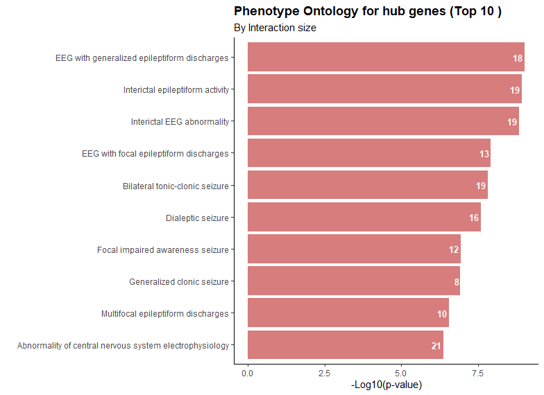

# **Identifying Glioma Biomarkers using Differential Gene Expression Analysis and Machine Learning**

## Glioma cancers

Gliomas are the most common central nervous system tumours (CNS). They account for approximately 30% of all primary brain tumours and 80% of all malignant tumours, with primary brain tumours causing a vast majority of cancer-related deaths. Gliomas can manifest in children and adults and their incidence depends on age, sex, and ethnicity [[1]](https://www.mdpi.com/1422-0067/22/19/10373). Gliomas occur in the glial cells of the brain and spinal cord and the glioma type depends on the glial cells they originate from. These cells include the astrocytes (astrocytoma), oligodendrocytes (oligodendrocytes/oligodendroglioma) [[2]](https://www.cancerresearchuk.org/about-cancer/brain-tumours/types/glioma-adults/) and the ependymal (ependymoma) glial cells [[3]](https://www.cancerresearchuk.org/about-cancer/brain-tumours/types/ependymoma/). The most common is astrocytoma which is characterised based on the WHO grades: pilocytic (Low Grade/Grade 1) which mainly occurs in children, diffuse (Grade 2), anaplastic (Grade 3) and glioblastoma (Grade 4) [[2]](https://www.cancerresearchuk.org/about-cancer/brain-tumours/types/glioma-adults/) with the survival rates decreasing with increase in grade [[1]](https://www.mdpi.com/1422-0067/22/19/10373).

Diagnosis and management of gliomas rely on tissue biopsy and treatment with radiotherapy and chemotherapy with genetic, transcriptomic and epigenetic alterations found to be key molecular signatures used in diagnosis and prognosis. Key biomarkers implicated in the pathogenesis of gliomas usually include genes involved in cell-cycle regulation. Some diagnostic and prognostic biomarkers implicated in glioma cancers include mutations in IDH, TP53, TERT, ATRX, and EGFR genes, 1p19q deletion, MGMT promoter methylation, etc [[4](https://www.frontiersin.org/journals/oncology/articles/10.3389/fonc.2014.00047/full), [5](https://pmc.ncbi.nlm.nih.gov/articles/PMC5337853/)]. Others include the mutations in the MAPK pathway genes, CDKN2A, MYB and MN1 genes [[1](https://www.mdpi.com/1422-0067/22/19/10373)].

Transcriptomics techniques, which use expression data generated from microarray and RNA sequencing methods, have been used to identify new biomarkers for glioma diagnosis and prognosis. This usually involves finding differential genes in normal and disease conditions. Similarly, machine learning models such as random forests, support vector machines, k-nearest neighbours, etc have been used to identify marker genes that can be used to predict disease outcomes or cancer subtypes [[6](https://www.sciencedirect.com/science/article/pii/S0888754319301740)]. Here, we apply transcriptomics data analysis to identify genes/RNA transcripts that can be used as potential biomarkers for glioma diagnosis. 

## Methodology

### Data source
Sixteen microarray datasets were downloaded from the Gene Expression Omnibus (GEO) database with assession numbers  GSE116520, GSE19728, GSE4290, GSE43289, GSE43378, GSE43911, GSE44971, GSE45921, GSE50161, GSE5675, GSE66354, GSE68015, GSE73066, GSE74462, and GSE90604.

### Data Preprocessing
Probes IDs in datasets were mapped to their respective gene symbols and common genes (12,699) in all datasets were selected for analysis. Datasets with untransformed expression values were log 2 transformed and all datasets were quantile transformed. To account for possible batch effect, batch effect correction was performed. Because the datasets were used for different experimental purposes, samples in each dataset related to gliomas were selected for analysis. These include ependymoma, glioblastoma, astrocytoma, oligodendroglioma or mixed gliomas (gliomas occurring in both astrocytes and oligodendrocytes). Finally, preprocessed datasets were merged and used for differential gene expression analysis.

### Data Analysis
Differential analysis was performed using the `limma` package in R (version 4.3.2). This was done to identify genes that are differentially expressed at disease conditions. Statistically significant genes based on p-value (false discovery rate, FDR) < 0.05 and absolute log fold change (logFC) of 1.5 and 2, depending on analysis criteria, were chosen as cutoffs. A volcano plot was used to visualise differential genes. Next, functional enrichment analysis was performed to determine enriched biological processes, molecular functions, cellular compartments and pathways these differential genes play roles in in human organisms.

Analysis was done in three areas:

- Finding differentially expressed genes in non-tumour and tumour conditions
- Finding differential genes at tumour grades: G1-G2, G2-G3, G3-G4  of astrocyte-related cancers. These include pilocytic astrocytoma (G1), Low-grade astrocytoma (G2), anaplastic astrocytoma (G3) and glioblastoma multiforme (G4). This will help us identify prognostic biomarkers or key changes in gene expressions with astrocytoma cancer progression.
- Finding differential genes at each cancer cell type of glioma cancer: Astrocytes, ependymomas, oligodendrogliomas/oligodendrocytes and mixed gliomas (oligoastrocytes and astrocytes) to identify genes that are different in each cell-type glioma cancers.

Machine learning techniques were used to predict tumour and non-tumour conditions and detect cancer progression of astrocytoma and cancer cell types. The dataset was randomly split into train and test sets in a 75/25 ratio where the training data was used for model development and the test set used for evaluating performance. To reduce computational time and the number of features, statistically significant genes in the differential expression analysis were selected for model development. Further feature selection method based on the model's inherent feature selection capability was used to obtain the important features.

## Results

### Differential gene expression analysis (DGEA)

#### Non-tumour vs Tumour conditions
Genes with absolute logFC above 2 were used as a cutoff to identify differential genes in disease and healthy (reference) conditions. 485 and 166 genes were found to be downregulated and upregulated, respectively, in the disease state. Among these genes are `SVOP`, `CYP4X1`, `FRMPD4`, `UHRF1`, and `PARP9`.

___Fig 1: Volcano plot showing down and upregulated genes as well as the not significant genes___

To understand the functions these genes play in the human organism, functional enrichment analysis was performed. These functions include the biological processes, the molecular functions of their gene products, the cellular components they are localised and also the biological pathways. Differential genes were grouped into up and down-regulated genes. From functional annotation results, these [upregulated genes](imgs/func_annotation/BP_up.png) are involved in inflammatory responses, play roles in the Wnt signalling pathway, have catalytic endopeptidase and peptidase activities, and are involved in cellular growth and differentiation such as the transition of cells from epithelial to mesenchymal cells. Similarly, [downregulated genes](imgs/func_annotation/BP_down.png) are mostly involved in nervous system regulation and development. These processes include the regulation of synaptic transmission, dendrite extension, cellular secretory pathways and neurotransmitter secretion and transport. Others include exocytosis and endocytosis of synapse vesicles, axon formation in the neuron, electric impulse/signal release from the neurons, and so on.

It was found that most of these [upregulated genes](imgs/func_annotation/cc_up.png) are components of the cell. These components include the extracellular matrix (ECM), the endoplasmic reticulum and the Golgi complex of the cell membrane. Other compartments include the actin filament, blood cells (platelets), and other cellular components. [Downregulated genes](imgs/func_annotation/cc_down.png) mostly form parts of the neuron such as the synapse, axon, and dendrite. Some others are found as part of ion-gated channels such as the sodium, calcium, and potassium channels. Furthermore, the molecular functions of the gene products of [upregulated genes](imgs/func_annotation/mf_up.png) include endopeptidase activity and binding as well as signalling pathways (chemokine binding) while some of the [downregulated genes](imgs/func_annotation/mf_down.png) are involved in neurotransmitter release and secretion as well as ion-channel activities (voltage-gated ion channel activities of monoatomic cations such as sodium and potassium). 

Additionally, KEGG pathway results reveal that [upregulated genes](imgs/func_annotation/kegg_up.png) are involved in many signalling pathways such as the p53, AGE-RAGE, P13K-Akt and Hippo pathways, and cell cycle pathways. They also play roles in disease or infection-related pathways such as cancer-related pathways, viral myocarditis, and viral infections. Others include extracellular cell matrix (ECM)-receptor interaction, cascade reactions of the Complement system, cellular senescence and protein digestion and absorption. However, [downregulated genes](imgs/func_annotation/kegg_down.png) are involved in pathways involving neurotransmitters, insulin, gastric acid and pancreatic secretion. They also play a role in the oxytocin and cyclic-adenosine monophosphate (cAMP) signalling pathways.

#### Tumour Grades
To identify biomarkers for tumour progression, DGEA was conducted on each grade of astrocytoma. Analysis was done by comparing the order of grade progression, that is, grade 1 and grade 2, grade 2 and 3, and grade 3 and 4, with the lower grade used as reference. The absolute logFC > 1.5 was used as the cutoff for finding differential genes. Between grades 1 and 2, 279 and 374 genes are up- and down-regulated as astrocytoma progresses from grade 1 to grade 2. Some of these genes include `SEMA3E`, `BLM`, `ETV5`, `CD24`, `SHANK2`, and `FBXO15`. From grade 2 to grade 3, 10 genes each were up and downregulated in both conditions while in grades 3 and 4, 4 and 12 genes were down and upregulated, respectively. 

One significant insight is that the number of differential genes decreases with cancer progression. One plausible reason would be the significant change in the tumour microenvironment as the tumour progresses which affects gene expression patterns in cells where at late stages the tumour cell has adapted to its tumour microenvironment leading to less significant expression levels [[7](https://link.springer.com/article/10.1007/s12094-024-03697-w)[8](https://www.mdpi.com/2073-4409/13/19/1666)]. Some of these differentially expressed genes are `GJB6`, `MKX`, `LYVE1`, `KIF20A`, `IGFBP2`, `FOXM1`, for grades 2 and 3, `SMOC1`, `KLHL32`, `DPP10`, `BCAT1`, and `MEOX2` for grades 3 and 4, etc, to mention just a few. These genes could act as diagnostic and prognostic markers and therapeutic targets for cancer-stage diagnosis and treatment. For instance, the `IGFBP2` gene which encodes the human insulin-like growth factor 2 (IGF2) mRNA binding proteins 2 is believed to be a prognostic marker for many cancer types especially lower-grade gliomas [[9](https://cancerci.biomedcentral.com/articles/10.1186/s12935-021-01799-x)].

Additionally, the `CHI3L1` gene which expresses the non-enzymatic Chitinase-3 like-protein-1 was found to be a common gene in these tumour grades. Fig 2 shows the expression levels of this gene by cancer grades. The expression level of this gene was found to be higher in grades 1, 3 and 4 compared to grade 2, with its median log2 expression level slightly above 8. This gene has been implicated in so many diseases such as astrocyte-related cancers [[10](https://www.nature.com/articles/s41392-020-00303-7)]. A summary of common genes in each cancer grade can be seen in Fig 3. 

___Fig 2: CHI3L1 expression level by astrocytoma cancer grades___

___Fig 3: Number of common genes in each stage transition___

Functional annotation result (Fig 4) shows that this gene, found in specific and secretory granule lumen of the cell is involved in eliciting cellular responses to immune cell activation, cellular regulation and tissue development. This gene also functions in hydrolase activities involving O-glycosyl compound hydrolysis.

___Fig 4: Number of common genes in each stage transition___

#### Cancer cell type
Glioma cancer can occur in any glial cell. To compare gene expressions in different glioma cells, DGEA was conducted to identify biomarkers that are unique to a particular cell type and common to all cell types. GSEA was conducted by comparing expression levels between astrocytoma and oligodendroglioma, ependymoma and mixed gliomas, ependymoma and mixed gliomas and oligodendrogliomas and mixed gliomas vs oligodendrogliomas. Differential genes (FDR < 0.05) were selected based on genes with at least 4-fold higher expression levels (logFC > 2) in one cell type compared to the other. Between astrocytoma and ependymoma, 237 downregulated genes and 173 upregulated genes were found. Between ependymoma and oligodendroglioma and ependymoma and mixed glioma, 84 and 24 genes were downregulated while 115 and 88 were upregulated, respectively. On another hand, the number of differential genes between astrocytoma and mixed glioma or with oligodendroglioma was few: 4 and 9 downregulated genes and 15 and 19 upregulated genes, respectively. This shows a close similarity between astrocytoma and oligodendroglioma and mixed glioma since mixed gliomas are cancers usually affecting both oligodendrogliomas and astrocytoma. However, no significant genes were found between mixed gliomas and oligodendrogliomas indicating that mixed gliomas may usually originate from oligodendrocytes and further affect astrocytes within them. 

The expression levels of `CAPSL`, `EFCAB1` `ETV1` and `SPAG6` genes were found to be statistically different between ependymoma and astrocytoma, mixed gliomas or oligodendroglioma. Comparing expression levels in normal cells of these cell types would provide insight into their expression levels in healthy and disease states in all cell types. Fifteen genes were found to be common in all the glial cell types. These include `C9orf24`, `CITED1`, `CNR1`, `CRLF1`, `DACH1`, `EFCAB1`, `GABRG1`, `LRP2BP`, `MKX`, `PPP1R1B`, `RELN`, `RSPH1`, `SPAG6`, `SRPX`, and `VIPR2`. Fig 5 shows a Venn diagram visualising common genes between cell types. Furthermore, the expression levels of these common genes were found to be the same in mixed gliomas and oligodendrogliomas compared to astrocytoma and ependymoma where in some cases, their expression levels were higher in ependymoma than in astrocytoma and vice-versa (Fig 6).

___Fig 5: Venn diagram showing the number of common genes in each cell type___

___Fig 6: Expression levels of common genes in all cancer cell types___

One biological process revealed by pathway analysis is that these common genes are involved in glial cell differentiation indicating that mutation in any of these genes during cellular growth and development could lead to dysregulation of cellular pathways and probably cancer (Fig 7). Similarly, some of the genes are found as part of dendrite cell components and GABA-A receptor complex and they also take part in signalling pathways such as the ligand-gated receptor binding and G-protein coupled receptor binding (Fig 8). In general, neuroactive ligand-receptor interaction and retrograde endocannabinoid signalling (KEGG pathway).

___Fig 7: Biological Process (Top 20) of common genes in all cancer cell types___

___Fig 8: Molecular Function (Top 20) of common genes in all cancer cell types___

### Protein-Protein Interaction

Protein-protein interaction (PPIs) was performed on differentially expressed genes in normal versus cancer states to understand the functional relationships between proteins and their impact on cellular processes. [Top 10% Genes](imgs/func_annotation/hub_genes_links.csv) by the number of interactions were selected. Cellular responses involving `SLC (17A7, 32A1)`, `GAD (1&2)`, `DLG4`, `SYP`, `TP53`, `SNAP25`, `GRIN2A`, `NRXNI`, and `SYN1` genes are mostly impacted in glioma cancers (Fig 9).

___Fig 9: Protein-Protein Interactions___

Functional enrichment analysis was performed on these hub genes. It was found that synaptic signalling, cell-cell signalling and communication, and neurotransmitter biological processes are enriched in cancer. These genes are found in synpase, cell junction, axon, and neuron compartments and function as transmembrane transporters and ion-channels. Pathways they play roles in the nervous system such as dopamine, acetylcholine, GABA, glutamate, and serotonin neurotransmission and release, protein-protein interactions at synapses and insulin secretion. Similarly, phenotypic outcomes of dysregulation of these genes affect the central nervous system and mainly include seizures (Fig 10). More information can be found [here](imgs/func_annotation/hub_gene_enrichment_result.csv)

___Fig 10: Hub Genes Phenotype Ontology___

### Machine Learning Results

Results can be found [here](./machine_learning_results.md)
