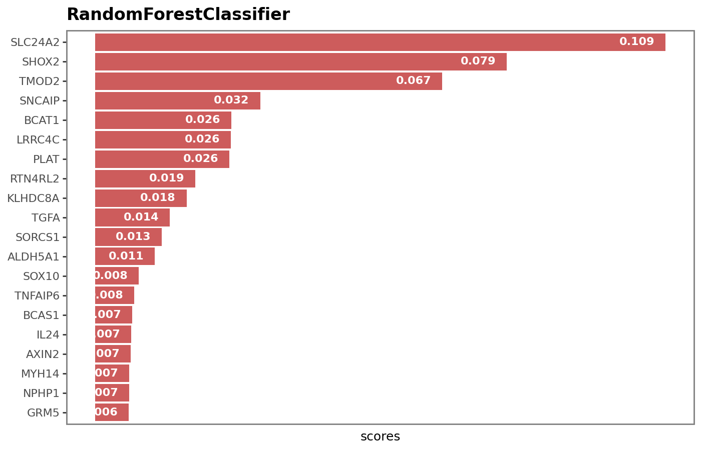

# Machine Learning Results
To predict disease outcomes, machine learning modelling was performed. Predictions were made to detect __normal and cancer samples__ and distinguish between __cancer grades__ and __cancer cell types__. Two models: Lasso Logistic Regression and Random Forest, were used.

## Data Preprocessing and Feature selection
Standardisation was applied to datasets used for Lasso logistic regression. Differential genes (adjusted p-value < 0.05) were selected for modelling. Further feature selection done by exploiting the inherent feature selection capability in the prediction model. For instance, for LASSO logistic regression, genes with non-zero coefficients were selected while for random forest, selection was done recursively by dropping features with zero importance scores until non-zero scores were obtained for all features.

## Model development and evaluation
The gene expression dataset was split into train and test sets (75/25), where the training set was used to develop a model and the test set was used to evaluate their performance. Performance was evaluated based on six metrics: accuracy, recall, precision, F1, Area under the receiver's operating characteristics (AUROC) and specificity. The precision-recall curve (PRC), AUROC curve and confusion matrix were used to visualise model performance. In addition, to select optimal features, a hyperparameter tuning technique (5-cross validation) was applied and the optimal parameter set with the highest AUROC score was selected as the best model to fit the train data and predict on the test data.

## Results
### Normal vs Cancer

__Table 1: Model performance evaluation on test data__

Model               |Accuracy |AUC     |Recall   |Precision |F1      |Specificity
--------------------|---------|--------|---------|----------|--------|-----------
Logistic Regression |0.980583 |0.998168|0.983516 |0.994444  |0.98895 | 0.958333
Random Forest       |0.995146 |0.999542|1.0      |0.994536  |0.99726 | 0.958333

___Figure 1: Visualisation showing Area under the receiver's operating characteristics and precision-recall curves and confusion matrix for Logistic Regression___

___Figure 2: Visualisation showing Area under the receiver's operating characteristics and precision-recall curves and confusion matrix for Random Forest___

From the results above, both models could efficiently classify cancer and normal samples from gene expression levels with high performance recorded in all the evaluation metrics. By in-class performance, we see that out of the 24 normal samples, 1 was incorrectly identified by both models, while 3 out of the 182 cancer samples were incorrectly classified by logistic regression (LR). This transcends to 88% precision, 96% recall for normal samples for LR and 99% precision, 98% recall and 99% F1-score for cancer samples. For RF, perfect scores were recorded for precision and recall for normal and cancer samples, respectively, and 99% precision and 96% recall for cancer and normal samples, respectively. By evaluating the number of genes selected by each model, 83 were selected by LR while 190 by RF with only 23 common genes between them. Some of which are AATK, ANXA5, CCNJL, UHRF1, YBX1, SH3TC2 and PLEKHA2.

### Astrocyte cancer grades 
The number of samples for each cancer grade include: 198 (G1), 166 (G2), 127 (G3), and 235 (G4). The classes were slightly imbalanced.

__Table 2: Model performance evaluation on test data__

Model               |Accuracy |AUC     |Recall   |Precision |F1      |Specificity
--------------------|---------|--------|---------|----------|--------|-----------
Logistic Regression |0.89011  |0.978937|0.89011  |0.892612  |0.888816| 0.966227
Random Forest       |0.879121 |0.974011|0.879121 |0.882374  |0.875654| 0.962661

___Figure 3: Visualisation showing Area under the receiver's operating characteristics and precision-recall curves and confusion matrix for Logistic Regression by cancer grades___

___Figure 4: Visualisation showing Area under the receiver's operating characteristics and precision-recall curves and confusion matrix for Random Forest by cancer grades___

From Table 2, both models have performance over 85% for all the evaluation metrics. However, when we look at their performance for each cancer grade from the confusion matrix (Figures 3&4), we see that the models could distinguish grades 1&2 (G1 & G2) from other grades (G3 and G4). For instance, no samples were misclassified as G1 for LR with only 1 misclassification for RF. When we look at the number of G1 & G2 samples misclassified, we see that only 1 each of G1 was misclassified to be G2 and G4, and 2 and 3 of G1 to be G3 & G4, respectively, for LR while 1 of G1 was misclassified to be G3 and 2 of G2 to be G4, by RF. Similarly, by evaluating their performance for G3 and G4, we see that 31-38% of G3 samples were misclassified as G2 or G4, while 8-12% of G4 were miclassified as either G1, G2 or G3, by the models. The high misclassification rate for G3 could be because it lies between transition of tumour cells from being benign to mildly aggressive and then to it spreading to other cells.

By default logistic regression deals with binary classes, but can be extended to more than two classes by applying a one-vs-rest technique where models are fit for each class where the positive class is encoded as 1 and the rest as 0. The number of non-zero features selected by each model for each class, include 1289, 1140, 1070 and 1189 for G1, G2, G3 and G4, respectively. By visualising in a Venn diagram (Figure 5), 12 genes were common for all grades. These include: `ACADS`, `C10orf25`, `CHCHD3`, `DLK2`, `EBAG9`, `HLX`, `MAX`, `MBD3L1`, `RBBP7`, `SLC13A4`, `TIAM2`, and `TNFSF8`, indicating that these genes could play as prognostic biomarkers for identifying cancer progression. This was further extended to find the number of common genes in both LR and RF models and from the result, 397 common genes were found out of the total 782 genes selected by RF. Figure 6 shows the top 20 genes selected by RF.

___Figure 5: Venn diagram showing commmon genes by cancer grade types for logistic regression__

___Figure 6: Top 20 genes selected by Random forest__

### Cancer cell types
The number of samples for each cancer cell type include: 498 for astrocytoma (AC), 118 for ependymoma (EP), 63 for oligodendrocytoma (OGC) and 15 for mixed glioma (MGC). To account for the class imbalance, a weights were applied on evaluation metrics.

__Table 3: Model performance evaluation on test data__

Model               |Accuracy |AUC     |Recall   |Precision |F1      |Specificity
--------------------|---------|--------|---------|----------|--------|-----------
Logistic Regression |0.91954  |0.958044|0.91954  |0.895321  |0.904553| 0.942156
Random Forest       |0.908046 |0.959538|0.908046 |0.880247  |0.890363| 0.938274

From Table 3, the models were performing well overall. However, when we look at their class-level performance, we see that both models were doing badly on some cell types (mixed gliomas and oligodendrocytoma). This could possibly be because of the huge class imbalance between them and the other cell types. However, the LR model seems performs better than the RF model in all evaluation metric except AUC with a slightly higher performance.

___Figure 7: Visualisation showing Area under the receiver's operating characteristics and precision-recall curves and confusion matrix for Logistic Regression by cancer cell types___

___Figure 8: Visualisation showing Area under the receiver's operating characteristics and precision-recall curves and confusion matrix for Random Forest by cancer cell types___

Figures 7 and 8 show the area under the receiver's operating characteristic curve (AUROC), precision-recall curve and confusion matrix charts for LR and RF models. From the AUROC and PRC results, we see good model performance for both models for astrocytoma and epedymoma, fairly good performance for oligodendrocytoma but bad performance for mixed glioma samples. From the confusion matrix, no mixd glioma sample was correctly detected by any of the models, with high misclassification rates for oligodendrocytoma. It could be seen that these cell types were misclassified as astrocytoma. This misclassification could be because of the imbalance nature of the dataset where both models are biased towards the majority class (astrocytoma). Another reason could be because of overlap of cellular features in terms of histology, location of the brain they originated from, molecular markers, or possibly due to incorrect labelling during biopsy.

To improve the sensitivity of the models to the minority class samples, latent features obtained from linear discriminant analysis were added, however this led to improved performance of the models on mixed glioma but higher misclassifications on astrocytoma and ependymoma cell types. Results can be found [here](imgs/ml_imgs/lr_lda_perf_chart_cell_type.png) and [here](imgs/ml_imgs/rf_lda_perf_chart_cell_type.png) for LR and RF, respectively.

To distinguish between cancer types, a total of 141 was selected by LR: 68 for astrocytoma, 33 for ependymoma, 7 for mixed gliomas, and 55 for oligodendrocytoma. No common gene was found for all the cell types. Furthermore, seven overlapping genes were found between ependymoma and astrocytoma, while 15 were found for astrocytoma and oligodendrocytoma (Figure 9). Additionally, 467 genes with non-zero scores were selected by RF, with only 42 common genes with LR.

___Figure 9: Venn diagram showing overlapping genes used by LR for each cell type___

In conclusion, machine learning models have been applied to gene expression data to predict disease outcomes. From the results above, we see that predictive models can be applied to gene expression data to identify diagnostic and prognostic biomarkers that can help to correctly distinguish between cancer and normal and identify cancer cell types and grades. Further analysis need to be done to validate findings. One is by identifying hub genes that affect downstream biological processes. Another is by conducting experimental studies to validate the effect of these biomarkers on biological processes, their molecular function and key pathways that are affected by their dysregulation.
