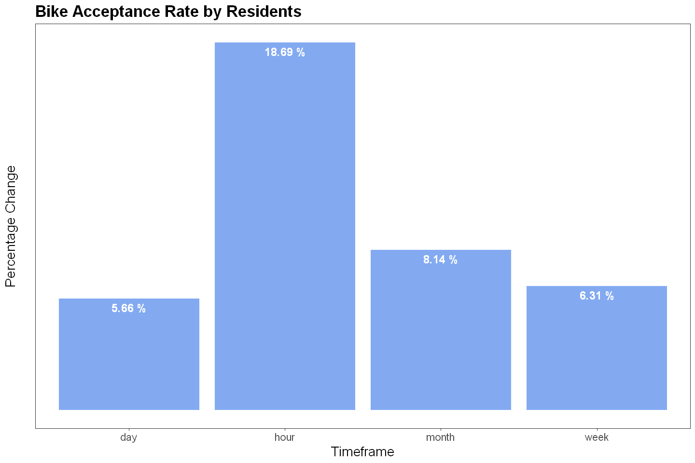

# Capital BikeShare

This repository contains analysis performed on bike rides rented by residents of Washington DC. Bike sharing service is provided by Capital Bikeshare. Dataset was downloaded [here](https://s3.amazonaws.com/capitalbikeshare-data/index.html) and contains hourly bike rides between January 2022 and June 2024. Dataset was collected using an API, the original format was preprocessed, aggregated and stored as a Comma Separated Values (csv) file.

Variables include

Name                      | Description
:-------------------------| :--------------------------------
Rideable Type             | Type of bike (E-bike or classic)
Duration                  | Duration of trip
Start Date                | Start date and time
End Date                  | End date and time
Start Station             | Starting station name and number
End Station               | Ending station name and number
Bike Number               | ID number of bike used for the trip
Member Type               | Indicates if a user is a registered user or a casual user.
Start and End coordinates | Latitude and longitude points of start and end stations

## Introduction 

A Bike sharing system is a shared transport service where bicycles are available for shared use by individuals at low cost. It allows individuals to borrow a bicycle from a station, ride it to a specific destination and then return it to any station within the system. Bike sharing presents benefits such as convenience, affordability, eco-friendly and it is a great way for bikers to get some exercise and fresh air.

In this notebook, we analyse the total hourly demand for bikes in all stations in Washington DC. This bike service is provided by [Capital Bikeshare](https://capitalbikeshare.com/) where an individual can unlock a bike by scanning its QR code using an app, ride on it and then park it at the nearest docking station at their destination. Two types of bikes are provided - electric (E-bikes) and classic bikes- and an individual can rent them on the short-term option by renting a single ride, obtaining a day pass or monthly membership and long-term by an annual membership option.

## Analysis Plan

In this analysis, we investigated the hourly demand for bikes (bicycles) by residents of Washington DC between Jan 2022 and June 2024. We wanted to understand 

- The performance of bike sharing in Washington DC
- The acceptance of the bike sharing system by Washington DC residents (users).
- The bike type preference of residents
- The demand for bikes at specific hours of the day, day of the week, or month or season of the year for better service.

To understand the performance of bike sharing in Washington DC, performance was measured based on key performance indicators, such as the total number of bike rides made between Jan 2022 and Jun 2024, the average hourly rides, the average distance travelled and the duration of bike trips. These metrics were extended to the bike types and membership status of users.

Citybikeshare offers two types of bikes (classic and E-bikes) for residents who are registered members and those who use them for casual use. To understand user preference, the percentage of rides made by registered or unregistered members and the percentage of rides made using classic or electric bikes were investigated. This was extended to preference between and within bike type and membership status. For instance, by finding the percentage of rides made by non-members or members using either bike type and the percentage of members or non-members who used either classic or bike types.

In 2020, the world was hit by the global COVID-19 pandemic. This event disrupted business, social and human activities. To understand the resumption of human and social activities, bike ride acceptance by Washington DC residents was investigated. This was done by estimating the average demand rate (percentage change) at specific time frames (hour, daily, and monthly). Acceptance was further investigated by comparing the average demand rate by bike type and comparing the year-over-year percentage change at these time frames (hourly, monthly, seasonally and yearly).

It is assumed that bike demand is affected by time. To answer this, we looked at the temporal variations of bike rides from Jan 2022 and Jun 2024, smoothened by a 28-day moving average. Next, the demand was divided into smaller groups (hourly, weekday, and monthly demands). This was extended by examining the demand for classic and electric bikes by users (members and non-members) at these time points.

## Dataset Description

Variable      | Description
:------------ | :-----------
rideable_type | Type of bike (E-bike or classic bike)
pickup hour   | Date and time (in hours of day) of pickup 
member_casual | Indicates if a user is a registered member or casual user. A member is an annual member, 30-day member or day key member. A casual ride includes single trips, 1, 3, or 5-day Pass
num_rides     | Total number of bike rides
duration_secs | Average duration of trips in seconds
distance_km   | Total distance travelled in kilometres
duration_mins | Average duration in minutes

## Analysis Findings

### A. Bike Performance

__Table 1: Bike Ride Performance__

|Name                  |Values        |
|:---------------------|-------------:|
|Total_Rides           | 10,190,395.00|
|Average_Hourly_Demand |        117.64|
|Average_Distance_km   |          1.00|
|Average_Duration_mins |         18.71|

Over 10.1 million bike rides were made between Jan 2022 and June 2024. This is about 117 rides per hour on average, with each user travelling at least 1 km in an average time of 19 minutes.

__Table 2: Performance by Membership Type__

|Name                  | Non-members| Members|
|:---------------------|-----------:|-------:|
|Average_Hourly_demand |       84.18|  150.76|
|Average_Distance_km   |        1.04|    0.96|
|Average_Duration_mins |       23.81|   13.67|

Registered members on the bike-sharing platform use more bikes than casual users. On average, a total of 84 bikes are requested by casual users while about 150 by registered members. Non-members use bikes mostly for long trips. Each trip embarked on by a casual user lasts at least 1 km on average in about 24 minutes while it is about 0.96 km in about 14 minutes for members.

__Table 3: Performance by Bike Type__

|Name                  | Classic| Electric|
|:---------------------|-------:|--------:|
|Average_Hourly_demand |  161.84|    73.42|
|Average_Distance_km   |    0.87|     1.12|
|Average_Duration_mins |   23.37|    14.06|

On the other hand, classic bikes are rented more than electric bikes. About 162 bikes are requested by users on average while it is about 73 for electric bikes. Electric bikes are mostly used for longer trips by users while classic bikes are used for shorter trips. A distance of 1.12 km was covered using electric bikes in a shorter time of about 14 minutes, while a distance of 870 m was covered by classic bike users in about 23 minutes on average. This is quite relatable due to the speed and convenience of electric bikes where so much efforts are needed to ride them, unlike the manual classic bikes.

### B. Bike preference and user patronage
Out of the 10 million rides from January 2022 to June 2024, classic bikes are the most used compared to e-bikes. About 69% of all rides were made using a classic bike (about 7.01 million) while 31% (3.2 million) were with an electric bike (Figure 1). On the other hand, most bike users are registered users who have an existing subscription with CapitalBikeShare. About 64.4% of all rides were made by members while about 35.6% by casual users (Figure 2). 

___Figure 1: Percentage of rides by bike type___

___Figure 2: Percentage of rides by membership status___

Out of the about 3.6 million rides made by casual users, 68.4% used classic bikes while about 32% used e-bikes. This is similar to rides made by CapitalBikeShare members (69% used classic bikes while 31 used e-bikes). On the other hand, of all the rented classic bikes or e-bikes, about 64-65% of them were rented by registered members while about 35-36% were by unregistered users.

__Table 3: Performance by Bike Type vs Membership Type__

|member_casual |rideable_type |total rides| perc_member_vs_bike_type| perc_bike_vs_member_type|
|:-------------|:-------------|----------:|------------------------:|------------------------:|
|casual        |classic       |  2,482,521|                    68.44|                    35.41|
|casual        |electric      |  1,144,702|                    31.56|                    36.00|
|member        |classic       |  4,528,211|                    68.99|                    64.59|
|member        |electric      |  2,034,961|                    31.01|                    64.00|

### C. Bike Ride Acceptance

To understand resident patronage and acceptance of bike sharing, we looked at the average hourly, daily, and monthly percentage change in bike demand by all users. This was extended by examining the percentage change by membership type and membership type for each bike type. Furthermore, we examined the year-over-year percentage change for classic and electric bikes by members and non-members as well as the year-over-year seasonal, monthly and yearly percentage change in bike patronage.

There's a high change in demand for bikes by residents per hour. On average, the hourly demand for bikes is about 18.7%, 5.7% per day, 6.3% per week and 8.14% per month. The high hourly demand rate indicates that there are times of the day when the demand is high and other times when it is low. This can be seen in the monthly demand rate (Figure 3). In terms of bike types, there's a high demand for both classic (~26%) and electric (~17%) bikes per hour and 6.7% and 4% per day, respectively, on average. The demand for either bike type is relatively the same per week (~6% respectively) while the demand for electric bikes (11.7%) increases monthly more than classic (7%) bikes. This change in monthly demand for electric bikes may be attributed to the use of electric bikes for long trips or summer vacations (Figure 4).

___Figure 3: Average demand rate per hour, month, day and week___

___Figure 4: Average demand rate per hour, month, day and week by bike type___

On the other hand, when we examine user acceptance by membership, we see that the hourly and weekly demands for bikes by non-members and members are relatively the same (Figure 5). However, the demand is more for casual users than members on a daily and monthly basis (10-12% for casual users and 4-7% for members). Also, by examining the demand rates for classic and electric bikes by registered and casual users, we see that the daily and monthly demand rates for classic bikes by casual users are twice that of registered users, while for other time frames, the demand rates are relatively the same (Figure 6). 

___Figure 5: Average demand rate per hour, month, day and week by membership type___

___Figure 6: Average demand rate per hour, month, day and week by bike type and membership type___

The use of electric bikes comes with benefits such as convenience, fast speed and efficiency, but it also comes with high costs from maintenance. To examine the rate of electric bike usage by residents we compared the year-over-year usage for both classic and electric bikes for each membership type. Our findings show that the usage of electric bikes increased by over 100% (136% for casual users and 192% for members) from 2022 to 2023 while classic bikes increased by 4-10% for casual and registered users, respectively. This shows that residents are now shifting to electric bikes for their day-to-day commute. In 2024, more than 80% of electric bike rides recorded in 2023 have been achieved in just 6 months and are expected to surpass the number recorded in 2023. However, for classic bikes, less than 50% of the rides recorded in 2023 have been achieved (Table 4).

In addition, the year-to-year seasonal, hourly, monthly and yearly demand rates were examined (figure not shown). Results show that there was an increase in demand/patronage by residents between 2022 and 2023 for either seasonal, hourly, monthly or yearly variations. The autumn of 2023 was 39% greater than bike rides in the year preceding it. For spring, it's about 29% (grew further by 6.6% in 2024), Summer about 23% while in Winter it grew by about 59% (more information [here](BikeSharesAnalysis.ipynb)). 

__Table 4: Year-over-year percentage change in bike type demands by membership types__

| year-over-year| classic-casual| classic-member| electric-casual| electric-member|
|---------------|---------------|---------------|----------------|----------------|
|      2022-2023|        4.06200|       10.47395|        135.6121|     192.238268 |
|      2023-2024|      -55.43749|      -54.91453|        -17.0934|      -6.188313 |

### C. Temporal variations and effects

#### Bike ride over time

By examining the hourly and daily bike rides (smoothened by a 28-day moving average), we see that there's a linear trend in the number of bike rides from January 2022 to June 2024. Similarly, bike rides are affected by seasons and months. There's higher patronage during summer than in winter periods. Bike rides rise from the beginning of every year, peaks in the summer and then declines towards the end of the year (Figure 7).

___Figure 7: Bike rides over time (28-day moving average)___

#### Hourly, monthly, and weekday effects

Apart from seasonal and monthly effects, the demand for bikes depends on the hour of the day. Bike rides peak in the morning (8-9 AM) and evening (5-6 PM) rush hours. Firstly, bike demand starts to increase at around 4 AM, peaks first at about 8 AM, declines slightly till about 11 AM before increasing a second time and peaking a second time at about 5 PM before a final decline till midnight and till 3 AM (Figure 8). This is the same for each bike type (figure not shown).

___Figure 8: Average hourly bike demand___

In as much as bike rides increase from the beginning of the year, peak in summer and decline towards the end of the year, there's an early decline for electric bikes in July unlike for classic bikes which declines a month after (August) for casual users and two months after (October) for members (Figure 9). Members mostly use bikes for their weekday activities either to commute to work or school etc while the demand for bikes by casual users is usually on weekends, probably, they use it for recreational activities or exercises (Figure 10).

___Figure 9: Average monthly demand by bike and membership types___

### D. User trip purpose (short or long trips)

To understand the purpose of bike rides by users, we investigated the average hourly distance and duration for bike trips taken by members and non-members using either bike type. The findings show that both user types use electric bikes to commute longer distances and it takes a shorter duration to reach their destinations. Members use classic bikes for short trips (<23 minutes), while casual users take a longer time to arrive at their destinations with the use of classic bikes even for shorter distances. Furthermore, bikes are used for longer distances in the early hours (2-4 AM) of the day (Figures not shown).
