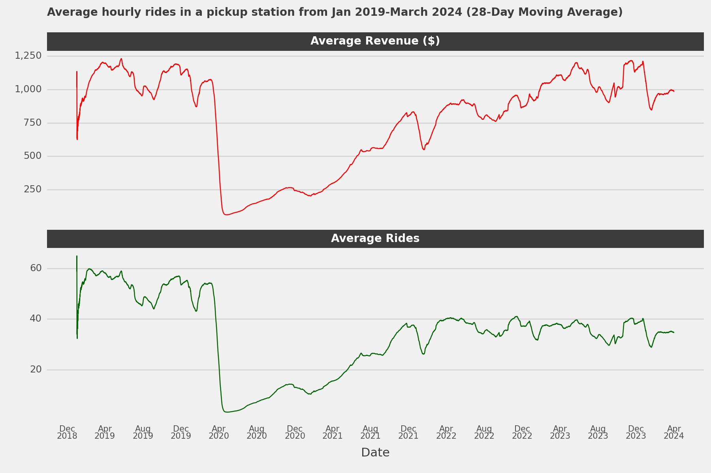
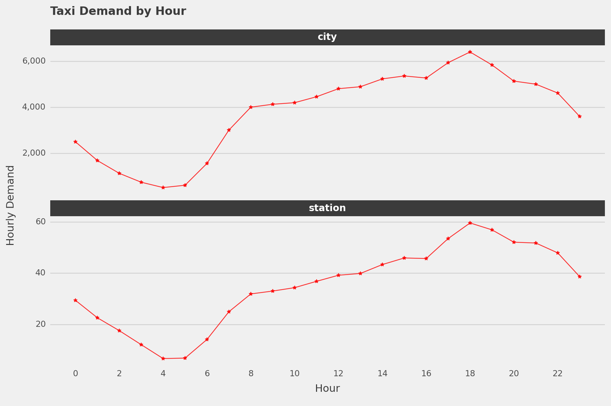
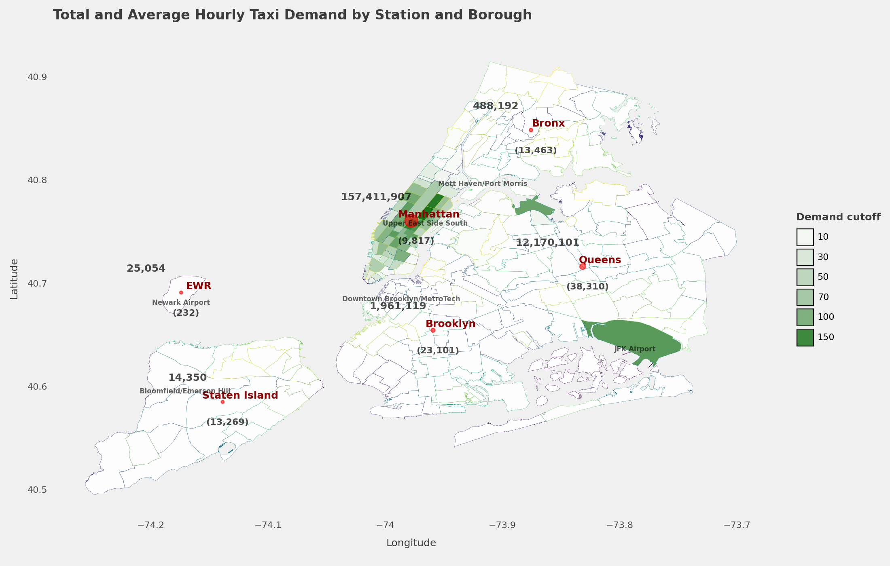
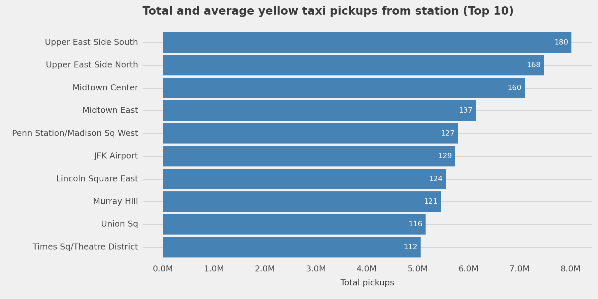
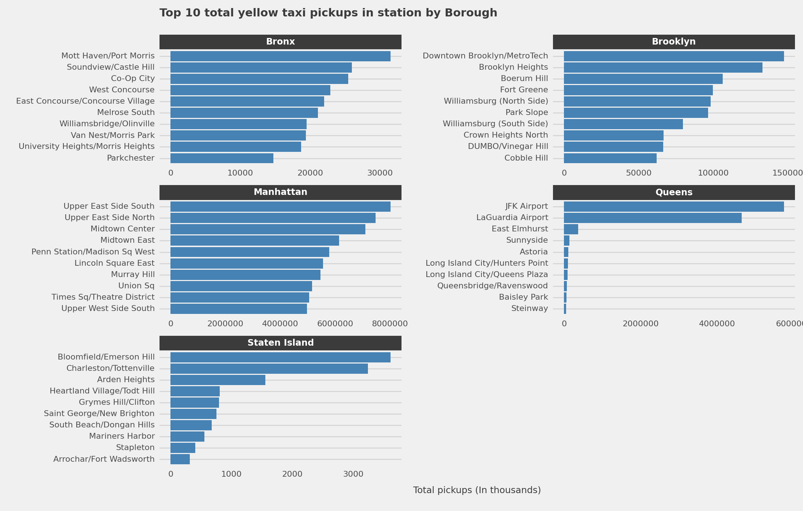
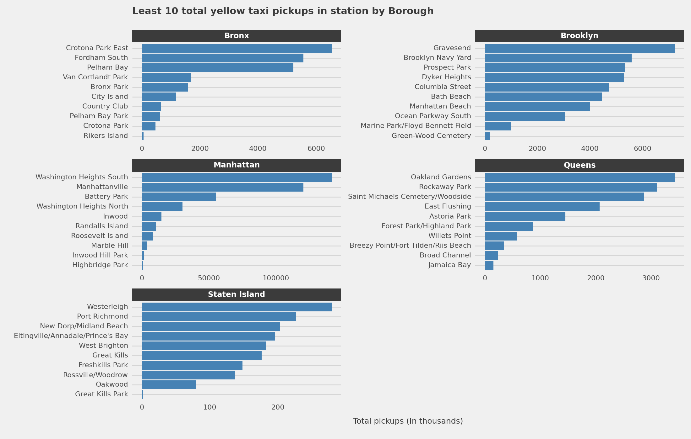
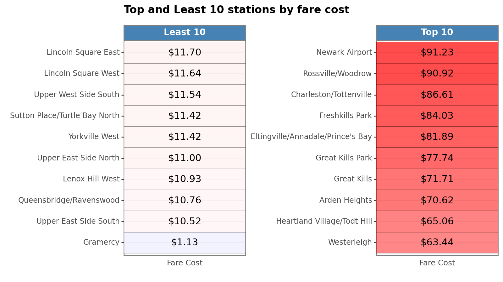
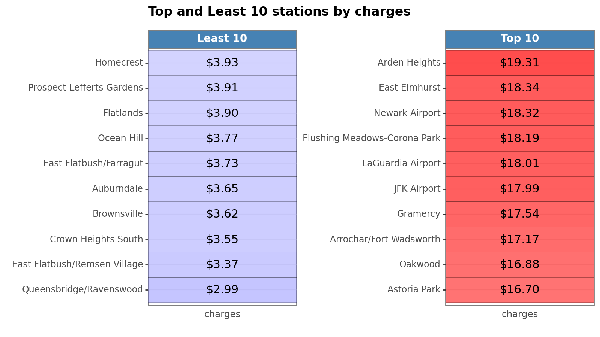
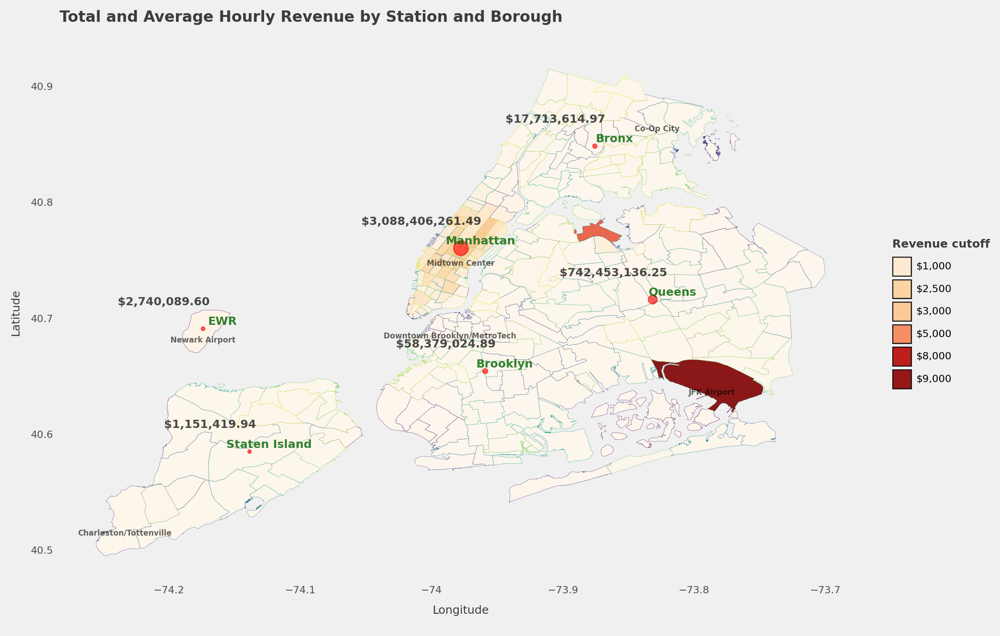

# **Analysis Findings**

We analysed New York's Taxi and Limousine Commission's (TLC) data about yellow taxi paid trips hauled between January 2019 and March 2024. The analysis was structured in six (6) main headings. We examined 

- The Key Performance Indicators (KPIs) such as the total volume of yellow taxis booked and paid for by commuters
- Temporal variations of taxi volume and revenue generated over time, per hour, day of the week, month, and year.
- The impact of holiday, seasonal and weekday events on the volume of taxi rides as well as the revenue generated
- The taxi demand across stations to understand the areas where demands are concentrated. This was investigated based on the top 10 and least 10 pickup and destination stations by ride volume. We further delved into finding the top and least 10 terminals by total pickup volume and revenue and grouping them into low, medium and high-demand areas. Next, we concentrated on the average taxi demand, revenue, total revenue generated from trip fares, the average fare cost and the charges levied per hour by these high-demand stations. This was done to identify the impact of the hour of the day on them. 
- The kind of trips that are made at the pickup stations. To do this, we grouped the average trip duration at pickup terminals into short, medium and long trips. After that, stations in boroughs were grouped based on the trip types and the number of stations in each borough in each group was identified. 
- The trip fares and charges at various pickup stations. We visualised their average values by trip types and ride demand groups. We also identified the top and least 10 pickup terminals by charges and trip fares. We also visualised the fare cost and charges across pickup stations per hour, month and month of every year.
- The total revenue and ride volume by borough and their average values across all pickup stations. This was visualised using a geographical map.

**A. Key performance summary**

***Table 1: Key Performance Summary***

Measure                                   | Value
:-----------------------------------------|:-------------------------------
Total Revenue                             | US$ 3.972 billion
Total Ride Volume                         | 173.9 million
Average Revenue (In a station)            | US$ 834.82
Average Revenue (In all stations)         | US$ 86,361.44
Average Ride volume (In a station)        | 37
Average Ride Volume (In all stations)     | 3,780
Average trip duration                     | 20.19 min
Average trip distance                     | 35.55 KM

Over 3.97 billion dollars have been generated in revenue by the TLC between January 2019 and March 2024 from over 173.9 million rides. This represents a revenue of 834.82 dollars on average in a pickup station and an aggregated revenue of 86,361 dollars on average across all pickup stations. However, 37 rides are demanded on average in a pickup station with an aggregate of 3,780 rides in all pickup stations in New York. 

**B. Temporal variations**

__Fig 1: Revenue generated vs Hourly rides over time (28-day moving average)__ 

Before COVID-19 incidence, an average of about 4,500 rides in total were demanded across all pickup stations per hour (over 40 per hour in a pickup station). However, this declined to almost less than 500 rides due to the COVID-19 lockdown in 2020 and has since increased over time but has remained relatively the same on average between 2022 and the present. Similarly, the impact of the COVID-19 lockdown in 2020 was evident in the revenue generated, but since the resumption of vehicular activities, the revenue generated has seen an uptrend on average from April 2020 till now (Fig 1). To further understand the impact of temporal variations on taxi demand, we drilled down into looking at the variations in hours of the day (Fig 2), day of the week and month of the year.

__Fig 2: Average hourly rides (in one station and all stations)__

We identified that the demand for taxis differs per hour of the day. During the late hours of the night and the early hours of the morning (12-4 AM), the amount of taxis demanded declines. The demand begins to rise first between 5 AM and the first rush hour of 8-9 AM, slowly increases and peaks at the next rush hour of the day (that is hours marking the end of working activities) which is 6 PM before declining till the night hours. This is the same every year. Furthermore, the average taxi ride demanded by commuters begins to increase at the start of the week (Sunday) and peaks on Thursday before declining slowly from Friday and Saturday. In addition, the monthly demand for taxis is usually low during major holidays and the month after a major holiday, decreasing from the start of the year to the middle of the year before increasing towards the end of the year. Overall, the amount of taxis demanded by commuters declines during the Summer holidays and the Christmas holidays.

**C. Impact of holiday events, seasons, and weekday/weekday on demand and revenue**

There's a statistical significance of the impact of seasonal events, holidays and weekends on the amount of rides demanded. Firstly, in the Summer, the number of taxis hauled is low compared to other seasons of the year. We assume that the reason for this decline is the vacation taken by most workers and as well the school holidays. In this season, most workers use this time to rest from work and re-strategise. Surprisingly, the amount of rides is the highest during the Winter season (average of 36 per hour). One reason for this is the many tourist and fun activities that happen in this season such as the Christmas and New Year activities where residents go out to have fun. They could go to parks, tourist centres, hiking, cultural events or visiting historical sites. The amount of taxis demanded on holidays is lower compared to non-holiday events, similarly, the amount of rides demanded on weekdays is slightly higher than on weekends at most hours of the day but higher in the early hours of the day, probably due to weekend long travels (figure not shown).

**D. Station popularity**

- By visualising areas where commuters are concentrated based on the average hourly pickups, we identified that our commuters are concentrated within Manhattan and some parts of Queens. This analysis was done to identify areas where we need to ensure enough taxis are available to deal with the demand (Fig 3).

__Fig 3: Map showing the concentration of commuters by average hourly pickups__
  
- By aggregating the number of pickups in all these stations from Jan 2019 to Mar 2024, the top 10 stations (Upper East Side (North and South), Midtown (Center and East), Penn Station/Madison Square West, JFK Airport, Lincoln Square East, Murray Hill, Union Square and Times Square/Theatre District) have recorded over 5 million pickups with an average pickup between 112 and 180 rides per hour. Next, we examined the amount in revenue generated by these top 10 stations. The result showed that over 90 million dollars have been generated by them with the station at JFK Airport generating over 400 million dollars, which is over 9,300 dollars generated per hour. For the other 9 top stations, the average revenue generated per hour ranges between 2,155 and 3,400 dollars. Next, we examined stations with the lowest pickups from Jan 2019 and Mar 2024. Ten of these stations have total pickups within 200 (1 pickup per hour) and less than 20,000 dollars generated in revenue. The station with the least total pickups is the station at Great Kills Park with less than 20 pickups.

__Fig 4: Top 10 pickup stations by ride volume__

- Furthermore, we examined the number of rides going (dropoffs) into each station, and it was found that 8 out of the top 10 stations by dropoffs are among the top 10 stations by pickups, with only stations at Upper West Side South and Lenox Hill West making the list. These stations have dropoffs between 98 and 180 per hour. Similarly, 6 out of 10 least stations by dropoff stations are amongst the least 10 stations by total pickups with stations at Port Richmond, Crotona Park, Willets Point and Broad Channel included in the least 10 dropoff stations.

- By drilling down into the least and top 10 stations in each borough by total pickups, stations with the least pickups are located in areas that are less visited such as tourist centres, beaches, bays, cemeteries and parks (Fig 6). The stations at JFK and LaGuardia airports are the top 2 stations in Queens by total pickups, representing over 85% of all pickups in that borough (over 4 million rides). Similarly, the top 10 stations in Manhattan recorded over 4 million rides (Fig 5).

__Top 10 stations by ride volume in each borough__

__Fig 5: Top 10 pickup stations by ride volume by borough__

__Least 10 stations by ride volume in each borough__

__Figure 6: Top 10 pickup stations by ride volume by borough__

- Next, we looked at the percentage of taxi dropoffs across stations. This was done by finding the fraction of all rides (pickup and dropoffs) that were dropoffs. This was to identify stations that are dropoff stations by commuters. This percentage of dropoffs was further grouped into three: stations where dropoffs were less than 45%, dropoffs almost equal with pickups (that's dropoffs between 45 and 60%) and a third group where dropoffs were above 60%. From the result, a majority (76.5%) of all stations in all boroughs, (few in Manhattan) had a higher percentage of dropoffs. These stations had median dropoffs of less than 20 per hour. Stations with equal dropoffs and pickups (19.6%) alongside those with lower dropoffs (3.9%) had a median value of 50 dropoffs per hour. 84% (42) of those with equal dropoffs and pickups were in Manhattan, the rest 16% corresponds to 6 in Queens, 1 in Staten Island and 2 in Brooklyn. Only a few stations (10) had higher pickups than dropoffs, with 6 of them located in Manhattan, 3 in Queens and 1 in Bronx.

- To further understand areas based on their hourly demand, the hourly demand of stations was grouped into low, medium and high, where low represents stations with average hourly demand less than the overall mean (15), medium between 15 and 100 (not inclusive) while high demand areas with 100 and above rides. 15 (about 6% of all stations) high-demand stations, located in Manhattan and Queens, contribute 54.1% of the total revenue generated and have about 127 taxis demanded per hour on average. 12% of them in medium-demand areas contributed 39.4% of revenue (55 taxis per hour on average) while the rest 82% generated 6.5% of the revenue (less than 2 rides per hour on average).

**E. Short, medium and Long trips**

To understand trips that are predominantly done in each station, we divided the average hourly duration of trips in each station into three groups. The first group include short trips (trips at most 15 minutes), medium trips (trips >15 and <= 45 minutes) and long trips for trips above 45 minutes. It was found that the majority of the stations (215 of them) were used for medium trips, 28 for short trips and the rest 16 for long trips. 13 of those used for long trips were stations located in Staten Island, 2 in Queens and 1 in Manhattan.

**F. Pricing Strategies**

Next, we delved into estimating the average trip charges and fare costs for stations. This was to determine pricing strategies in stations.

- Firstly, we visualised the average charge and fare cost for stations by ride demand and trip type. From the result, long trips are associated with stations with low demand. The trip cost and charge depend on the trip type (short, medium or long trips) and the fare cost in low-demand stations is higher than fares in medium or high-demand stations. On average, fares for medium or long trips in low-demand areas cost between 25 and 30 dollars while long trips cost over 60 dollars in the same group.

- On the other hand, charges levied seem to depend on the trip distance and taxi demand type. For instance, charges for a long-distance trip are around 11 dollars on average while charges for high-demand areas used for medium-distance trips cost more (more than 9 dollars on average). These high charges for medium-trips in high-demand stations could come from airport fees as we see that the station at JFK airport is a high-demand station or congestion fees while the high charges seen in long distance trips could come mainly from toll fees. Meanwhile, charges depend on other fees such as improvement surcharges, congestion surcharges, MTA taxes, and other miscellaneous surcharges from rush hour and overnight trips.

- The top 10 stations by charges are mostly stations located in facilities such as tourist attraction centres, parks, and airports while the top 10 stations with the least charges are mainly stations located in villages, counties or low populated areas. Stations with the highest fare cost are mainly stations used for long trips while those with the lowest fares are stations predominantly used for short trips.

___Trip cost___

__Figure 7: Top & Least 10 pickup stations by trip cost__

___Charges___

__Figure 8: Top 10 pickup stations by trip charges__

- Next, we examined if the charges and fare costs depend on the hour of the day. Results show that there are higher fares in the early hours of the day between 12 AM and 3 AM which declines at 8 AM after which trip fares begin to slightly increase till the end of the day. Similarly, there are higher charges during the summer season than in any other season. On the other hand, trip charges look irregular but tend to increase at late and early hours of the day or at taxi-tab peak periods.

**G. Borough and pickup station performance**

Finally, we visualised the performance of stations and boroughs by average rides and revenues, total rides and revenue generated and the number of cities/places/towns found in them. (Fig 3) It was found that 91% (over 157 million) of all rides recorded and the average hourly demand concentrated in Manhattan with hourly demands above 30. Next were stations at the LaGuardia and JFK airports in Queens. Similarly, over 3 billion dollars in revenue was generated in Manhattan, followed by Queens with over 742 million dollars while Staten Island generated the least with about 1.2 million dollars (Fig 9).

__Fig 9: Map showing the average revenue obtained by stations in boroughs__

# **Conclusion**

In conclusion, taxi cabs provide the easiest and fastest way for commuters to get to their destinations on time, especially for last-minute trips, navigating unfamiliar locations, or ensuring a comfortable ride with luggage. For travellers unfamiliar with a city's layout or those with limited mobility, taxis offer a reliable and stress-free option. Additionally, taxis can often provide a more personalized experience compared to ride-sharing services.

Here, we analysed yellow taxi cab demand in the city of New York. We investigated the overall performance of taxi rides in a pickup station and all stations. We examined the impact of hours, seasons, weekends and holiday events on the demand for taxis. We also investigated the areas where taxi demand is concentrated, the top and least 10 pickup stations based on demand, the type of trips commuters mostly make and the revenue generated by different boroughs.

From the analyses, the following insights were obtained

- Over $3.9 billion in over 173 million rides was generated in revenue by TLC for yellow taxis hauled between January 2019 and March 2024. This represents an average revenue of $834.32 from an average of 37 rides per hour in a pickup station and over $86,000 in revenue in all stations and 3,750 rides in all pickup stations.
- The demand for taxis depends on some temporal factors such as hours, holidays, and season of the year.
- Most pickup stations with high taxi demand are located in Manhattan with only two from the Queens borough.
- The least 10 stations in terms of taxi demand are stations located in areas that are less visited such as tourist centres, beaches, bays, cemeteries and parks.
- Commuters mostly haul taxis for medium trips (ie trips between 15 and 45 minutes). Most of the long trips were hauled mostly from low-demanded stations with most of them located in Staten Island.
- Charges and the cost of a trip depend on trip distance and type of demand in pickup stations. Pickup stations with low demand are mostly used for long journeys hence have higher trip costs and are charged higher than pickup stations with medium or high demand. Similarly, trip costs and charges depend on the facilities found in the location such as airports, recreational parks and tourist centres as well as the population of people within the location.
- Additionally, the cost of a trip is higher when the demand is low. For instance, it costs higher during the night hours than the day hours. On the other hand, there are higher charges during the early or late hours of the morning and rush hours. Trip costs and charges are higher in the second quarter of the year than in the first quarter and then stay relatively the same throughout the year.

Therefore, identifying the impact of hours of the day, seasons and holidays on the demand for taxis as well as the type of demand at various pickup stations is important to provide seamless services to commuters to enable proper allocation of taxis at locations where they are mostly needed. Also, identifying the cost of a trip and its charges will enable TLC to come up with pricing strategies to encourage commuters to patronise yellow taxi cabs to increase revenue.
