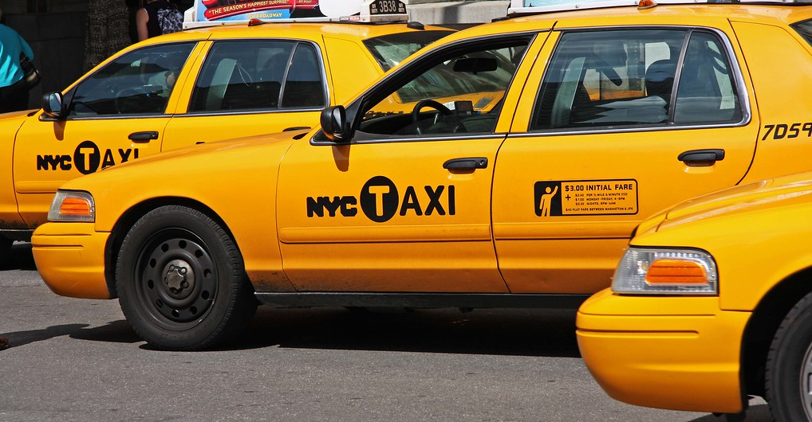
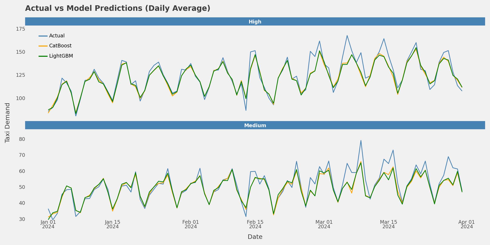
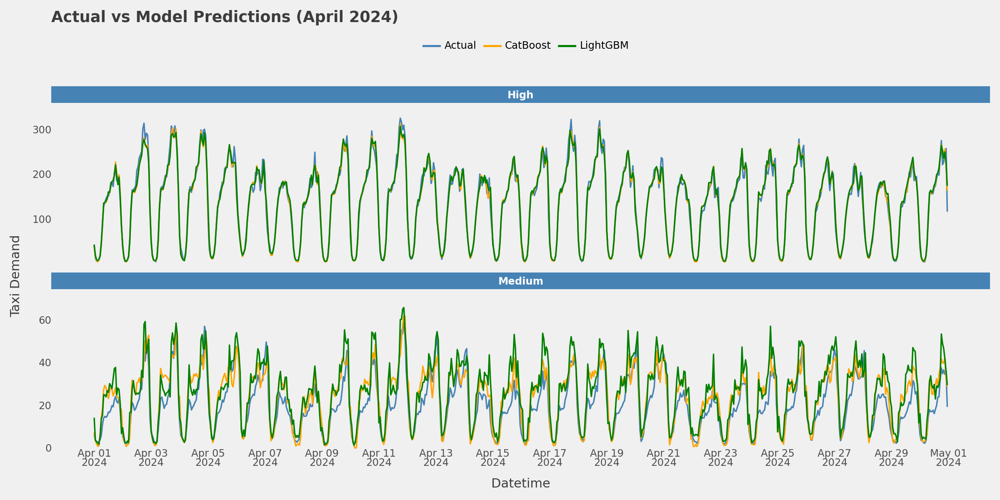
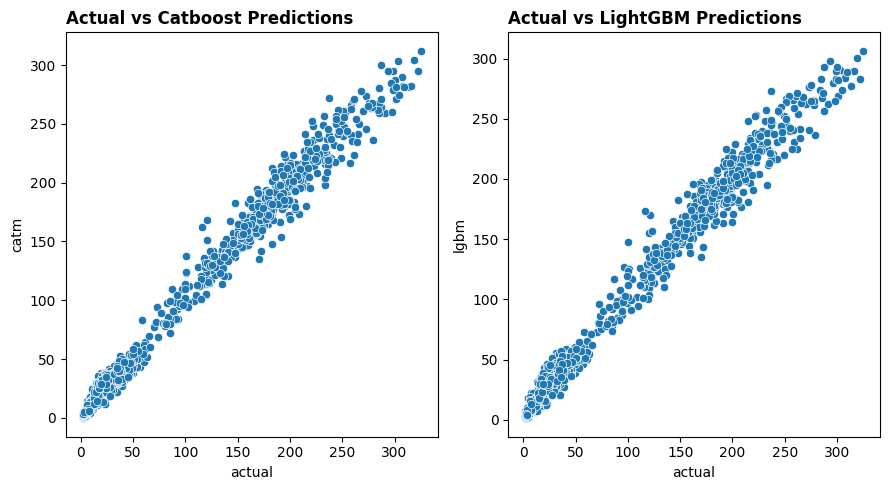

# **Understanding Yellow Taxi Cab Demand In New York**

## **Introduction**

In today's urban landscape, taxi and car rental services have become essential transportation options. These services provide immediate mobility solutions, offering vehicles with experienced drivers to fulfil passengers' transportation needs. Whether for business trips, daily commutes, or leisure activities, hailing a taxi, booking by phone, or requesting online provides a convenient and efficient way to travel from point A to point B.  Compared to public transportation, taxis and car rentals offer greater flexibility, allowing on-demand travel and door-to-door convenience.  Moreover, these services cater to diverse needs with budget-friendly taxis and spacious rental cars. Technological advancements have streamlined the process with ride-hailing apps simplifying booking and payment.  These services not only cater to individual needs but also potentially play a role in easing traffic congestion by reducing reliance on personal vehicles for short trips.
This analysis focuses on the hourly demand for Yellow cabs at car-hire stations around New York from January 2019 to March 2024. For simplicity, we have selected paid rides —whether by cash or credit card—with total amounts greater than zero. Our goal is to unravel the performance dynamics of yellow taxis within the city during the specified timeframe. 🚖🗽

## **Dataset**

The dataset contains car rides for yellow taxi cabs in the environs of New York, made from Jan 2019 to Mar 2024. Data was obtained from [TLC Trip record data](https://www.nyc.gov/site/tlc/about/tlc-trip-record-data.page). The original data contains information about the pick-up and drop-off dates/times, pick-up and drop-off locations, trip distances, itemized fares, rate types, payment types, and driver-reported passenger counts. The data were collected and provided to the NYC Taxi and Limousine Commission (TLC) by technology providers authorised under the Taxicab & Livery Passenger Enhancement Programs (TPEP/LPEP).
Taxi trips paid by credit cards or cards were filtered, aggregated and stored in a database. The database contains trip records for pickup and dropoff stations. The pickup station's record contains the total number of trips leaving the station, the average distance of all trips, the average duration of all journeys and the revenue generated from all trips per hour of each day while the dropoff station's record contains the total number of trips arriving the station, the average distance and duration of all trips.

## __Analysis workflow__

Analysis workflow is divided into two main parts: Exploratory Data Analysis (EDA) & Modelling

### Exploratory Data Analysis

In the EDA part, analyses were divided into the following headings below. Different database queries were made to extract relevant information and further steps were taken using the `pandas`, `seaborn`, `plotnine`, `matplotlib` libraries etc.

**A. Yellow taxi performance summary** 

Here, the performance of taxi demand and revenue generated were summarised. The summary included

- the total volume of rides demanded by commuters from January 2019 and March 2024.
- the total revenue generated between the same time frame
- the average amount of money generated in revenue in one station and in all stations per hour
- the average number of taxis demanded by commuters in one station and in all stations per hour
- The average distance travelled and average duration of each trip.

**B. Temporal variations** 

Here, we investigated the total number of taxi rides and revenue generated over time and at various times of the year. Analysis was done station-wise (in a pickup station) and city-wise (in all pickup stations). This was done to determine if cab demand and revenue are significantly affected by temporal variations (hour, day of week, month and year) and also to understand taxi demand in New York at these times to provide better service to commuters.

**C. Impact of Holiday events, seasonal and weekend/weekday on demand and revenue**: 

Here, we compared ride volume and revenue on holidays and special events with regular days and if these events significantly impact demand. Similarly, we investigated customer behaviour by comparing ride volume and revenue patterns on weekdays and weekends and seasons of the year and if there's a significant difference in customer behaviour.

**D. Station popularity**

Here, we analysed the number of rides originating from each pickup and dropoff station. We looked at the top and at least 10 pickup and dropoff terminals. The goal was to understand customer-concentrated areas and ways to optimise service availability.

**E. Short vs Long trips**

Here, we examined pickup stations associated with shorter or longer trips. Longer and shorter trips were estimated by reviewing the average duration of trips in each station and grouping them into short or long trips based on a duration cutoff (15 rides).

**F. Station Pricing**

We examined the average cost a trip costs in a pickup station and the average amount incurred in charges. This was investigated based on the top 10 cheap and expensive stations across New York. The goal was to understand pricing strategies and various ways to increase revenue.

**G. Borough and pickup station performance**

The performance of pickup stations and all pickup stations in all the boroughs of New York were examined. This was visualised in a map that showed the average revenue and taxi demand in all the pickup stations. This map had information about the total revenue generated and taxi rides demanded in each borough.

The findings can be found [here](EDA/README.md)

[Notebook Link](Taxi_demand_analysis/EDA/Yellow_taxi_analysis.ipynb) 

### Modelling

In this part, we will predict the average number of taxis demanded by commuters per hour in all stations. During the exploratory data analysis, demand group criteria were created, and demand at pickup stations was classified into low, medium, and high. As a result, this predictive modelling task aims to accurately predict taxi demand in medium and high areas to provide adequate taxis to meet the demand.

For the task, hourly demands between Jan 2019 and April 2021 were dropped due to the disruption caused by COVID-19 (only hourly rides from May 2021 and March 2024 were selected for modelling). Feature engineering and data transformations were performed to prepare the dataset for modelling. Feature engineering techniques included converting categorical variables to numeric variables using one-hot encoding or binary encoding. Others include extracting date features such as hour, month, season, day of the year, weekday, etc, categorising precipitation from the weather data and creating lagged and rolling features of the demand variable. In addition, the test dataset (Taxi demands for April 2024) was preprocessed to match the historical dataset.

For modelling, the dataset was split into training and validation sets where demands before Jan 2024 were in the training data while the validation data contains demands between Jan 2024 and March 2024. The training set was used to fit a model and performance was evaluated on the validation data. A baseline model which predicts the average hourly rides for each demand group was used. 

Two evaluation metrics: root mean squared error and mean absolute errors were used to evaluate the model's performance. To understand, the model's performance on the validation set, a 5-fold cross-validation method was used where data at each iteration was split in a time-series fashion, where the heldout data contains 3 months of data. After evaluating performance on the validation set, the whole historical data were then used to fit a model and the model's performance was evaluated on the test data (April 2024).

[Notebook link](modelling/new_york_yellow_taxi_demand_modelling.ipynb)

#### Modelling Results

**Table 1: Validation data metrics**

Model    | RMSE   | MAE
:--------|-------:|------:
Naive    |25.4509 | 18.0859
CatBoost |13.2474 | 7.3250
LightGBM |13.3635 | 7.4841

__Figure 1: Daily actual and predictions on validation data__

**Table 2: Test data metrics**

Model    | RMSE   | MAE
:--------|-------:|------:
CatBoost |9.5740	| 6.8133
LightGBM |10.3520	| 7.5352

__Figure 2: Daily actual and predictions on Test data__

__Figure 3: Relationship between actual and predicted taxi demands by catboost and lightgbm models__
